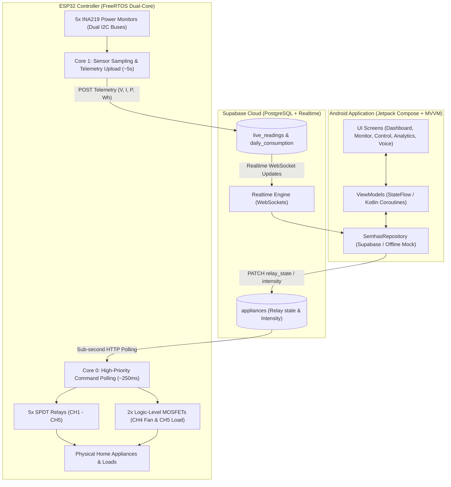

# SEMHAS — Smart Energy Management & Home Automation System

[](https://github.com/Aritra-Saha14/SmartHome)
[](https://kotlinlang.org)
[](https://developer.android.com/jetpack/compose)
[](https://supabase.com)
[](https://espressif.com)
[](https://github.com/Aritra-Saha14)

SEMHAS (**Smart Energy Management and Home Automation System**) is an end-to-end, commercial-grade smart home IoT platform. It integrates a native modern Android application (Jetpack Compose & Material 3), a cloud synchronization and analytics backend (Supabase Realtime & PostgreSQL), and a dual-core FreeRTOS firmware running on an ESP32 microcontroller with physical power monitoring, relay switching, and MOSFET PWM load control.

---

## 📑 Table of Contents

- [System Architecture & Data Flow](#-system-architecture--data-flow)
- [Key Features](#-key-features)
- [Hardware Architecture & Pinout](#-hardware-architecture--pinout)
- [Android Mobile Application](#-android-mobile-application)
- [Cloud & Supabase Backend](#-cloud--supabase-backend)
- [ESP32 Firmware Architecture](#-esp32-firmware-architecture)
- [End-to-End Workflow](#-end-to-end-workflow)
- [Getting Started & Installation](#-getting-started--installation)
- [Testing & Verification](#-testing--verification)
- [Directory Structure](#-directory-structure)
- [Author & License](#-author--license)

---

## 🏗️ System Architecture & Data Flow

SEMHAS is designed with a decoupled, reactive architecture ensuring real-time bidirectional control, high reliability, and low latency:



---

## ✨ Key Features

1. **Dual-Path Control**:
   - **Binary Switching**: Independent ON/OFF control for all 5 channels via SPDT mechanical relays.
   - **Variable Speed / Intensity**: Dedicated 8-bit PWM (5 kHz) control for **CH4** (e.g., 2-wire CPU cooling fan) and **CH5** (e.g., dimmable lighting or variable heater) with 4 discrete stepped levels: `25%`, `50%`, `75%`, and `100%`.
2. **Precision Electrical Telemetry**:
   - Continuous real-time measurement of **Voltage (V)**, **Current (A / mA)**, **Active Power (W)**, and accumulated **Energy (Wh / kWh)** per channel using calibrated Texas Instruments **INA219** high-side current and power sensors.
3. **Smart Billing & Cost Estimation**:
   - Real-time running bill estimation based on user-configurable electricity tariff rates (`₹/kWh` / `₹/Wh`).
   - Dynamic monthly budget threshold with persistent preferences and alert notifications.
4. **Interactive Energy Analytics**:
   - Aggregated consumption history across daily, weekly, and monthly periods with custom chart bucketing, peak-appliance breakdowns, and historical trends.
5. **Hands-Free Voice Control**:
   - Integrated offline wake word detection powered by `openWakeWord` with interactive voice feedback and status orb animations.
6. **Robust Dual-Core FreeRTOS Firmware**:
   - Sub-second relay response time (~250ms) decoupled from sensor telemetry reading.
   - Dual independent I2C hardware buses preventing sensor bus lockups.
   - Wi-Fi watchdog with non-blocking reconnection state machines.

---

## 🔌 Hardware Architecture & Pinout

### 1. Relays & Load Actuation (Active HIGH)
| Channel | Appliance Default | Relay GPIO | MOSFET Gate GPIO | Control Type |
|---|---|---|---|---|
| **CH1** | Living Room Light | `GPIO 14` | *None* | Binary ON / OFF Relay |
| **CH2** | Bedroom Fan | `GPIO 27` | *None* | Binary ON / OFF Relay |
| **CH3** | Television | `GPIO 26` | *None* | Binary ON / OFF Relay |
| **CH4** | Exhaust / CPU Fan | `GPIO 25` | `GPIO 13` | Relay ON/OFF + 8-bit PWM Speed |
| **CH5** | Dimmable / Variable Load | `GPIO 33` | `GPIO 12` | Relay ON/OFF + 8-bit PWM Intensity |

*Note: MOSFET gates use a 220Ω series resistor and a 10kΩ pull-down resistor to common GND.*

### 2. INA219 Current & Power Sensors (Dual I2C Buses)
To prevent address collisions and ensure I2C bus stability, sensors are distributed across two independent hardware I2C controllers:
- **I2C Bus 1** (`Wire` on `SDA = GPIO 21`, `SCL = GPIO 22`):
  - **CH1**: Address `0x40`
  - **CH2**: Address `0x41`
  - **CH3**: Address `0x44`
  - **CH4**: Address `0x45`
- **I2C Bus 2** (`Wire1` on `SDA = GPIO 18`, `SCL = GPIO 19`):
  - **CH5**: Address `0x40`

### 3. PWM Configuration
- **Frequency**: `5000 Hz`
- **Resolution**: `8-bit` (Range: `0 - 255`)
- **Duty Conversion**:
  - `0%`   $\rightarrow$ `0`
  - `25%`  $\rightarrow$ `64`
  - `50%`  $\rightarrow$ `128`
  - `75%`  $\rightarrow$ `191`
  - `100%` $\rightarrow$ `255`

---

## 📱 Android Mobile Application

The Android client is built with **100% Jetpack Compose** adhering to Google's Modern Android Architecture guidelines.

### Screen Hierarchy
1. **Home / Dashboard**: Overview of real-time power, today's energy usage, live estimated cost, monthly progress, quick actions, and 5-channel status cards.
2. **Live Monitoring**: Detailed electrical readouts (Voltage, Current, Power, Energy, Runtime, Estimated Cost, Sensor Health) aligned on a structured grid.
3. **Channel Control**: Full device state toggling, appliance renaming, and stepped speed/intensity buttons for CH4 and CH5.
4. **Energy Analytics**: Interactive bar charts for Daily, Weekly, and Monthly consumption, appliance percentage distribution, and budget limits.
5. **Billing Screen**: Tariff rate adjustment (₹/kWh), cumulative running costs, and period energy totals.
6. **History Screen**: Chronological audit log of manual actions, automated triggers, and abnormal events.
7. **System Health**: ESP32 heartbeat monitoring, Wi-Fi RSSI, uptime, and sensor diagnostic status.
8. **Voice Control**: Voice orb visualizer with local voice recognition triggers and intent execution.
9. **Notifications**: Alerts on power spikes, budget limit warnings, and connectivity status.
10. **Settings / Security**: Dark / Light theme selection, device identifiers, and data preferences.

---

## ☁️ Cloud & Supabase Backend

The system uses Supabase PostgreSQL with the following database tables:

- **`devices`**: Device registration (`id`, `device_code`, `status`, `last_seen`).
- **`appliances`**: Current channel state (`id`, `device_id`, `channel_number`, `appliance_name`, `relay_state`, `intensity`).
- **`live_readings`**: High-frequency snapshot of electrical metrics (`voltage`, `current`, `power`, `recorded_at`).
- **`daily_consumption`**: Persistent historical day-by-day energy consumption (`energy_wh`, `runtime_seconds`, `consumption_date`).
- **`energy_readings`**: Timestamped energy deltas used for analytics rollups.

---

## ⚙️ ESP32 Firmware Architecture

The ESP32 firmware ([SEMHAS_Phase3_Supabase.ino](firmware/SEMHAS_Phase3_Supabase/SEMHAS_Phase3_Supabase.ino)) operates using FreeRTOS multi-tasking:

1. **`commandSyncTask` (Core 0)**:
   - Polls `/rest/v1/appliances` every 250ms over HTTP using persistent connections.
   - Instantly applies relay changes and PWM intensity downlinks.
   - Emits structured diagnostic logs:
     ```text
     [SEMHAS][INTENSITY] CH4 received = 75%
     [SEMHAS][PWM] CH4 duty = 191
     ```
2. **`telemetryTask` (Core 1)**:
   - Polls INA219 sensors at 50ms intervals with bus timeout guards.
   - Computes rolling power and integrating milliwatt-hours into Watt-hours.
   - Posts telemetry batches to Supabase REST API every 5 seconds.
3. **Network Recovery Subsystem**:
   - Handles Wi-Fi connection loss with exponential backoff and watchdog restarts if connectivity is persistently disrupted.

---

## 🔄 End-to-End Workflow

### Downlink: Changing Fan Speed to 75%
1. User taps **75%** on the CH4 card in the Android app.
2. `ControlViewModel.setChannelIntensity(4, 75)` invokes `SupabaseSemhasRepository`.
3. Repository logs `[SEMHAS][INTENSITY] CH4 -> 75%` and sends an HTTP PATCH to Supabase `appliances.intensity`.
4. ESP32's `commandSyncTask` receives `intensity = 75` during its ~250ms polling cycle.
5. Firmware calls `applyIntensityDownlink(4, 75)`, logs `[SEMHAS][INTENSITY] CH4 received = 75%` and `[SEMHAS][PWM] CH4 duty = 191`.
6. ESP32 writes `191` to `GPIO 13` via `ledcWrite()`. The physical fan accelerates immediately to 75% speed.

### Uplink: Energy Metering & Billing
1. INA219 measures bus voltage (e.g. `12.1V`) and shunt drop on CH4.
2. Firmware calculates active power ($P = V \times I$) and integrates energy ($Wh = Wh + \frac{P \times \Delta t}{3600}$).
3. Telemetry is uploaded to Supabase `live_readings` and aggregated into `daily_consumption`.
4. The Android app's Realtime channel receives the new energy delta and updates the Live Monitor and running billing balance.

---

## 🚀 Getting Started & Installation

### Android Application
1. **Clone the repository**:
   ```bash
   git clone https://github.com/Aritra-Saha14/SmartHome.git
   cd SmartHome
   ```
2. **Configure credentials**:
   Create or update `local.properties` in the project root:
   ```properties
   sdk.dir=C:/Users/<Username>/AppData/Local/Android/Sdk
   SUPABASE_URL=https://<your-project-ref>.supabase.co
   SUPABASE_ANON_KEY=<your-supabase-anon-key>
   ```
3. **Build & Run**:
   Open the project in Android Studio (Iguana / Jellyfish or newer) and run the `app` configuration on an Android device or emulator (API 26+).

### ESP32 Firmware
1. Open [firmware/SEMHAS_Phase3_Supabase/SEMHAS_Phase3_Supabase.ino](firmware/SEMHAS_Phase3_Supabase/SEMHAS_Phase3_Supabase.ino) in Arduino IDE.
2. Install required Arduino libraries:
   - `Adafruit INA219`
   - `ArduinoJson` (v6 or v7)
   - `WiFi` / `HTTPClient` / `WiFiClientSecure`
3. Configure your Wi-Fi SSID, Password, and Supabase credentials in the sketch configuration section:
   ```cpp
   const char* WIFI_SSID = "Your_2.4GHz_SSID";
   const char* WIFI_PASSWORD = "Your_WiFi_Password";
   const char* SUPABASE_URL = "https://<your-project-ref>.supabase.co";
   const char* SUPABASE_ANON_KEY = "<your-supabase-anon-key>";
   ```
4. Select board **ESP32 Dev Module** and flash via USB.

---

## 🧪 Testing & Verification

The project includes an automated JUnit test suite for business and state logic:

```bash
# Run unit tests via Gradle wrapper
./gradlew testDebugUnitTest
```

### Key Test Coverage:
- **`ApplianceIntensityTest`**: Validates capability restrictions (CH1–CH3 disabled, CH4–CH5 enabled), renaming immunity, stepped intensity transitions (25%, 50%, 75%, 100%), and channel isolation.
- **`AnalyticsLogicTest`**: Validates historical data bucketing, calendar month bounds, Wh telemetry accumulation, and monthly bill limit persistence.
- **`VoiceCommandParserTest`**: Validates natural language intent parsing for appliance control.

---

## 📁 Directory Structure

```text
SmartHome/
├── app/                                # Android Application module
│   ├── src/
│   │   ├── main/
│   │   │   ├── java/com/semhas/app/
│   │   │   │   ├── data/               # Models, repositories, DTOs, preferences
│   │   │   │   ├── navigation/         # Jetpack Compose routes & BottomNav
│   │   │   │   ├── ui/                 # ViewModels, Composables, Theme, Components
│   │   │   │   ├── utils/              # Formatters, constants, helpers
│   │   │   │   └── voice/              # openWakeWord manager & command parser
│   │   │   └── res/                    # Drawables, mipmaps, XML configs
│   │   └── test/                       # Unit test suites
├── docs/                               # Engineering documentation & PRD
│   ├── ARCHITECTURE.md                 # System architecture overview
│   ├── BILLING_LOGIC.md                # Electricity pricing & tariff calculations
│   ├── DATA_MODEL.md                   # Core entity representations
│   └── PRD.md                          # Product requirements document
├── firmware/                           # ESP32 Firmware
│   └── SEMHAS_Phase3_Supabase/
│       └── SEMHAS_Phase3_Supabase.ino  # FreeRTOS dual-core Arduino sketch
├── build.gradle.kts                    # Top-level Gradle build script
├── gradle.properties                   # JVM & build configurations
└── README.md                           # Main documentation (this file)
```

---

## 👤 Author & Credits

- **Author**: [Aritra Saha](https://github.com/Aritra-Saha14)
- **Project**: SEMHAS — Smart Energy Management & Home Automation System
- **Repository**: [https://github.com/Aritra-Saha14/SmartHome](https://github.com/Aritra-Saha14/SmartHome)